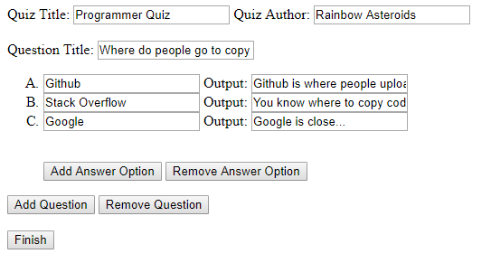

# ProgressiveSurvey
A survey creator that gives results per question, not per survey.

## How it works

Quiz Title: The title of the quiz that will show
Quiz Author: The author of the quiz
Question Title: The title of the question

Below are the answer options. The first field is the option the user will see, the second field is the result the user will see when they pick said option.
The buttons are self explanitory.

Once you press finish you will download a `.json` file. This file contains your quiz. You need this file to use `quiz.html`.
